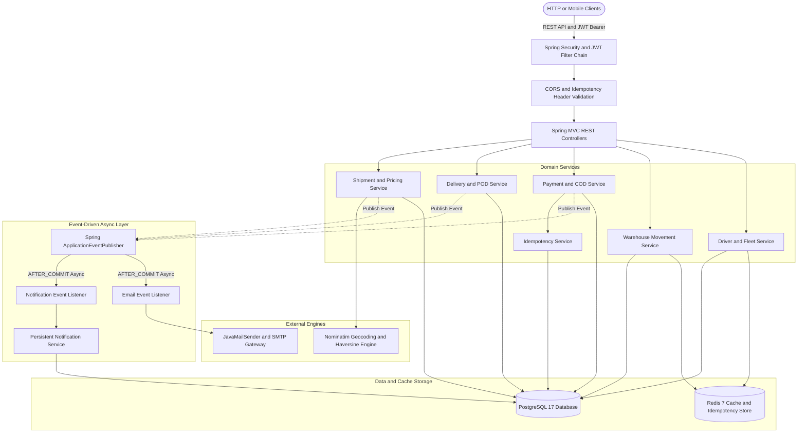
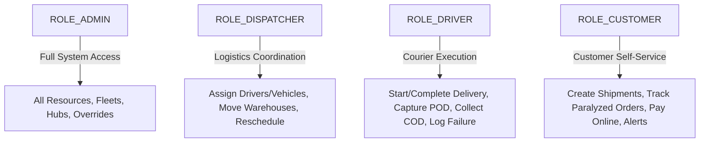
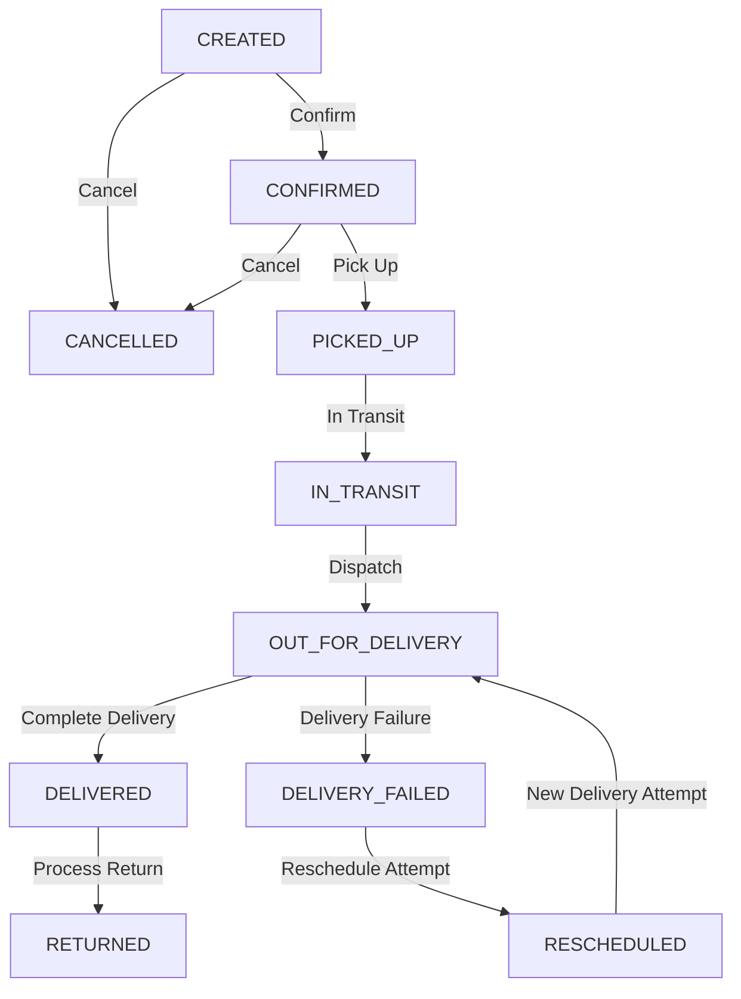
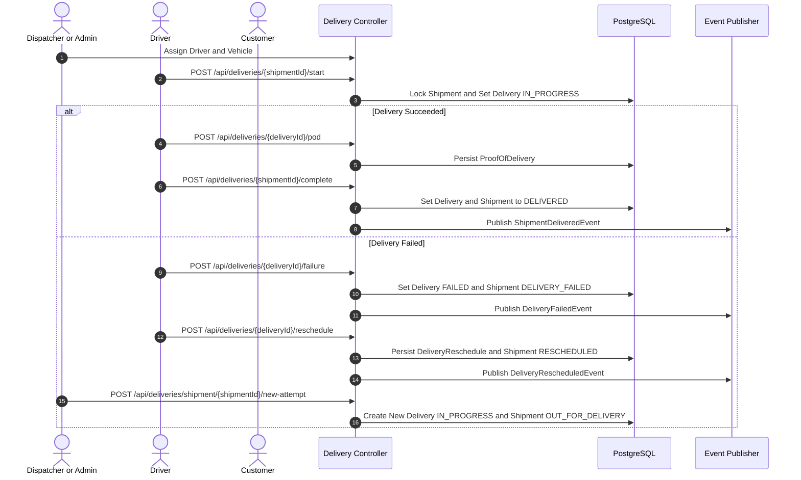
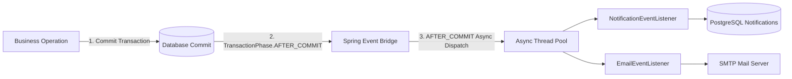

# 🚚 Enterprise Logistics Management System

`Java 21` `Spring Boot 4.1.1` `PostgreSQL 17` `Redis 7` `Docker` `Spring Security` `JWT` `OpenAPI` `Actuator`

Production-grade Spring Boot 4.1.1 Logistics and Supply Chain Management platform built with Java 21, PostgreSQL 17, Redis 7, Spring Security with JWT, SpringDoc OpenAPI, and Spring Boot Actuator.

---

## 1. Overview

The **Logistics Management System** is a modular enterprise backend engineered to automate the end-to-end lifecycle of parcel delivery and freight transportation. It provides centralized control over:

- **Customer & Fleet Operations**: Self-service customer accounts, commercial fleet inventory, and delivery driver personnel management.
- **Automated Geocoding & Route Distance Calculation**: Automatic conversion of textual pickup and destination addresses into coordinates and calculating road distances using OpenStreetMap Nominatim and routing engines.
- **Dynamic Tiered Pricing Engine**: Real-time shipping fee calculation factoring in shipment service type, chargeable package weight, and calculated road distance.
- **Multi-Facility Warehouse Movement**: Inbound, outbound, and cross-dock inventory movement tracking between regional distribution branches and fulfillment centers.
- **Shipment Lifecycle State Machine**: Finite state machine governing shipment progression from order intake to last-mile delivery, return, or cancellation.
- **Dispatch & Last-Mile Delivery Execution**: Courier assignment, real-time dispatching, recipient validation, and digital Proof of Delivery (POD) capture.
- **Delivery Exceptions & Rescheduling**: Comprehensive incident logging for delivery failures and automated rescheduling workflows for subsequent delivery attempts.
- **Electronic Payments & Cash on Delivery (COD)**: Dual payment architecture supporting credit cards and physical cash collection with Redis-backed distributed idempotency.
- **Event-Driven Asynchronous Notifications**: Decoupled domain events dispatched after database transaction commits, processing in-app alerts and multi-recipient SMTP emails asynchronously.

---

## 2. Key Features

- **Automated Geocoding & Distance Calculation**: Integrates with OpenStreetMap Nominatim to resolve physical addresses to geographical coordinates with Redis geocoding caching and Haversine distance computation.
- **Formula-Driven Pricing Engine**: Enforces server-calculated pricing `TotalPrice = BasePrice + AdditionalWeightFee + DistanceFee` preventing client-side price tampering.
- **Distributed Idempotency Protection**: Protects critical financial and collection endpoints using `Idempotency-Key` headers, SHA-256 payload hashing, atomic Redis reservations, and isolated PostgreSQL storage transactions (`REQUIRES_NEW`).
- **Pessimistic Concurrency Control**: Prevents race conditions during driver assignment, vehicle dispatch, payment confirmation, and COD collection using `PESSIMISTIC_WRITE` row locks.
- **Event-Driven Async Subsystem**: Publishes application domain events (`ShipmentDeliveredEvent`, `PaymentPaidEvent`, `CodCollectedEvent`, etc.) processed via `TransactionPhase.AFTER_COMMIT` on an isolated `ThreadPoolTaskExecutor`.
- **Multi-Channel Notifications**: Automatically records persistent PostgreSQL notifications and dispatches asynchronous emails via JavaMailSender.
- **Role-Based Access Control (RBAC) & Method Security**: Enforces granular permissions (`ADMIN`, `DISPATCHER`, `DRIVER`, `CUSTOMER`) with custom SpEL security beans protecting against Insecure Direct Object References (IDOR).
- **Production Hardening**: Non-root Docker execution, container memory awareness (`-XX:MaxRAMPercentage=75.0`), graceful shutdown, HikariCP connection pooling, strict Hibernate schema validation (`validate` in production), and selective Actuator metrics exposure.

---

## 3. Architecture

The application adopts a domain-driven, layered architecture where business logic is strictly decoupled from transport protocols, external services, and background event listeners.



### Architectural Flow:
1. **Client Request**: Clients transmit requests over HTTPS presenting a JWT Bearer token in the `Authorization` header.
2. **Security & RBAC**: The request passes through `JwtAuthenticationFilter`. Custom bean expressions (`@shipmentSecurity`, `@deliverySecurity`, etc.) verify resource ownership and role permissions.
3. **Controller Layer**: REST controllers validate incoming payloads using `@Valid` and delegate directly to domain services. Controllers return immutable DTO records (`*Response`).
4. **Service Layer**: Executes business rules, calculates pricing, acquires pessimistic database row locks where required, manages transaction boundaries (`@Transactional`), and invalidates affected Redis cache keys.
5. **Persistence Layer**: Spring Data JPA repositories read and write data to PostgreSQL 17 using connection-pooled HikariCP data sources.
6. **Event Dispatching**: Upon successful transaction commit, domain events trigger `@Async` listeners in a dedicated thread pool to persist notification history and send outbound emails without blocking client threads.

---

## 4. Tech Stack

| Component | Technology | Version | Purpose |
|---|---|---|---|
| **Language** | Java | 21 (LTS) | Modern Java runtime, record classes, pattern matching |
| **Framework** | Spring Boot | 4.1.1 | Dependency injection, MVC, transactional management |
| **Security** | Spring Security | 6.x | Stateless JWT authentication, RBAC, method security |
| **Tokens** | JJWT (io.jsonwebtoken) | 0.12.6 | HMAC-SHA256 access and refresh token management |
| **Database** | PostgreSQL | 17 | Relational persistence, ACID transactions, row-level locks |
| **ORM** | Spring Data JPA / Hibernate | 6.x | Object-relational mapping, custom repository queries |
| **Caching** | Redis / Spring Data Redis | 7 | Cache management, geocoding cache, session store |
| **Connection Pool** | HikariCP | 5.x | High-performance JDBC connection pooling |
| **API Docs** | SpringDoc OpenAPI | 2.8.5 | Swagger UI 3.0 interactive documentation |
| **Monitoring** | Spring Boot Actuator | 4.1.1 | Health checks, metrics, and JVM runtime metrics |
| **Email** | Spring Boot Starter Mail | 4.1.1 | SMTP mail generation and transmission |
| **Container** | Docker & Docker Compose | Latest | Multi-container orchestration and deployments |

---

## 5. Roles & Permissions

The platform enforces Role-Based Access Control (RBAC) with 4 distinct roles:



| Entity / Operation | `ADMIN` | `DISPATCHER` | `DRIVER` | `CUSTOMER` |
|---|:---:|:---:|:---:|:---:|
| **User Registration / Login** | Public | Public | Public | Public |
| **Manage Customers** | All | — | — | Own Profile |
| **Manage Fleet & Vehicles** | Full CRUD | Read-Only | Read-Only | Read-Only |
| **Manage Drivers** | Full CRUD | Read & Status | Own Profile & Status | — |
| **Manage Branches & Warehouses** | Full CRUD | Read-Only | Read-Only | Read-Only |
| **Create Shipment** | Yes | Yes | — | Own Account |
| **View Shipment / Tracking** | All | All | Assigned Only | Own Shipments |
| **Assign Driver/Vehicle** | Yes | Yes | — | — |
| **Warehouse Movements** | Yes | Yes | — | — |
| **Start / Complete Delivery** | Yes | Yes | Assigned Only | — |
| **Proof of Delivery (POD)** | Create/Read | Create/Read | Create/Read (Assigned) | Read (Own) |
| **Report Delivery Failure** | Create/Read | Create/Read | Create/Read (Assigned) | Read (Own) |
| **Reschedule Delivery** | Yes | Yes | Yes (Assigned) | Read (Own) |
| **Create & Process Payment** | Manage | Manage | — | Create/Read (Own) |
| **Cash on Delivery Collection** | Manage | Manage | Collect (Assigned) | Read (Own) |
| **Notifications** | Own Alerts | Own Alerts | Own Alerts | Own Alerts |

---

## 6. Authentication

The authentication system is completely stateless and utilizes JSON Web Tokens (JWT) signed using the HMAC-SHA256 algorithm.

- **Password Hashing**: Uses Spring Security's `BCryptPasswordEncoder` with a configurable strength factor (default: 12).
- **Access Tokens**: Short-lived JWTs (default: 15 minutes / 900,000 ms) containing the user's email, ID, and granted authorities.
- **Refresh Tokens**: Long-lived JWTs (default: 7 days / 604,800,000 ms) stored on the client to securely acquire fresh access tokens.

### Authentication Endpoints

#### Register User
- **Endpoint**: `POST /api/auth/register`
- **Access**: Public
- **Request Body**:
```json
{
  "email": "ahmed.customer@example.com",
  "password": "Password123!",
  "firstName": "Ahmed",
  "lastName": "Hassan",
  "role": "CUSTOMER"
}
```
- **Response**: `201 Created` with `AuthResponse`.

#### Login
- **Endpoint**: `POST /api/auth/login`
- **Access**: Public
- **Request Body**:
```json
{
  "email": "ahmed.customer@example.com",
  "password": "Password123!"
}
```
- **Response**: `200 OK` with `AuthResponse`.

#### Refresh Token
- **Endpoint**: `POST /api/auth/refresh`
- **Access**: Public
- **Request Body**:
```json
{
  "refreshToken": "eyJhbGciOiJIUzI1NiIsInR5cCI6IkpXVCJ9..."
}
```
- **Response**: `200 OK` with `AuthResponse`.

### Authentication Response Schema (`AuthResponse`)
```json
{
  "accessToken": "eyJhbGciOiJIUzI1NiIsInR5cCI6IkpXVCJ9.eyJzdWIiOiJhaG1lZC5jdXN0b21lckBleGFtcGxlLmNvbSIsImF1dGhvcml0aWVzIjpbIlJPTEVfQ1VTVE9NRVIiXSwiaWF0IjoxNzg1NDIxNjAwLCJleHAiOjE3ODU0MjI1MDB9.s8f_xR...",
  "refreshToken": "eyJhbGciOiJIUzI1NiIsInR5cCI6IkpXVCJ9.eyJzdWIiOiJhaG1lZC5jdXN0b21lckBleGFtcGxlLmNvbSIsImlhdCI6MTc4NTQyMTYwMCwiZXhwIjoxNzg2MDI2NDAwfQ.d7k_bM...",
  "tokenType": "Bearer",
  "expiresIn": 900000
}
```

---

## 7. API Documentation

### 7.1 Customer Management

Handles shipper and recipient client profiles, contact numbers, and default billing/pickup addresses.

| Method | Path | Summary | Authorization |
|---|---|---|---|
| `POST` | `/api/customers` | Register customer profile linked to user account | `CUSTOMER`, `ADMIN` |
| `GET` | `/api/customers/me` | Retrieve authenticated customer's profile | Authenticated |
| `GET` | `/api/customers/{id}` | Retrieve customer profile by ID | Customer Owner, `ADMIN` |
| `PUT` | `/api/customers/{id}` | Update customer details | Customer Owner, `ADMIN` |
| `DELETE` | `/api/customers/{id}` | Delete customer profile | Customer Owner, `ADMIN` |

#### Customer Response Schema (`CustomerResponse`)
```json
{
  "id": 1,
  "userId": 10,
  "email": "ahmed.customer@example.com",
  "firstName": "Ahmed",
  "lastName": "Hassan",
  "phone": "+201012345678",
  "address": "15 El-Tahrir Square",
  "city": "Cairo",
  "postalCode": "11511"
}
```

---

### 7.2 Driver Management

Manages courier personnel, driving licenses, validity dates, assigned vehicles, and real-time duty status (`AVAILABLE`, `ON_DUTY`, `BUSY`, `OFF_DUTY`).

| Method | Path | Summary | Authorization |
|---|---|---|---|
| `POST` | `/api/drivers` | Register a driver profile | `ADMIN`, `DRIVER` |
| `GET` | `/api/drivers/me` | Get current driver's profile | Authenticated Driver |
| `GET` | `/api/drivers` | List all drivers (cached) | `ADMIN`, `DISPATCHER` |
| `GET` | `/api/drivers/{id}` | Get driver by ID (cached) | Driver Owner, `ADMIN`, `DISPATCHER` |
| `PATCH` | `/api/drivers/{id}/status` | Update driver availability status | Driver Owner, `ADMIN`, `DISPATCHER` |
| `PUT` | `/api/drivers/{id}` | Update driver profile details | Driver Owner, `ADMIN` |
| `DELETE` | `/api/drivers/{id}` | Remove driver profile | Driver Owner, `ADMIN` |

#### Driver Response Schema (`DriverResponse`)
```json
{
  "id": 1,
  "userId": 11,
  "email": "mohamed.driver@example.com",
  "firstName": "Mohamed",
  "lastName": "Mostafa",
  "phone": "+201098765432",
  "licenseNumber": "DL-EG-987654",
  "licenseExpiryDate": "2028-12-31",
  "status": "AVAILABLE"
}
```

---

### 7.3 Fleet & Vehicle Management

Tracks transportation assets, vehicle types (`MOTORCYCLE`, `VAN`, `TRUCK`, `REFRIGERATED_TRUCK`), plate numbers, payload capacities, and availability statuses (`AVAILABLE`, `IN_USE`, `MAINTENANCE`, `OUT_OF_SERVICE`).

| Method | Path | Summary | Authorization |
|---|---|---|---|
| `POST` | `/api/vehicles` | Register a new vehicle | `ADMIN` |
| `GET` | `/api/vehicles` | List all vehicles (cached) | Authenticated |
| `GET` | `/api/vehicles/{id}` | Get vehicle by ID (cached) | Authenticated |
| `GET` | `/api/vehicles/plate/{plateNumber}` | Get vehicle by plate number (cached) | Authenticated |
| `PUT` | `/api/vehicles/{id}` | Update vehicle specifications and status | `ADMIN` |

#### Vehicle Response Schema (`VehicleResponse`)
```json
{
  "id": 1,
  "plateNumber": "CAI-1234",
  "type": "VAN",
  "status": "AVAILABLE",
  "brand": "Mercedes-Benz",
  "model": "Sprinter 314",
  "manufacturingYear": 2023,
  "maxWeightKg": 1500.0
}
```

---

### 7.4 Branch & Hub Management

Manages regional logistics offices, distribution headquarters, and operational sorting hubs.

| Method | Path | Summary | Authorization |
|---|---|---|---|
| `POST` | `/api/branches` | Create a new regional logistics branch | `ADMIN` |
| `GET` | `/api/branches` | List all logistics branches (cached) | Authenticated |
| `GET` | `/api/branches/{id}` | Get branch by ID (cached) | Authenticated |
| `GET` | `/api/branches/code/{code}` | Get branch by unique code (cached) | Authenticated |
| `PUT` | `/api/branches/{id}` | Update branch contact info or address | `ADMIN` |

#### Branch Response Schema (`BranchResponse`)
```json
{
  "id": 1,
  "name": "Cairo Central Logistics Hub",
  "code": "CAI-HUB-01",
  "address": "Plot 42, Nasr Road, Nasr City",
  "city": "Cairo",
  "postalCode": "11765",
  "phone": "+20223456789",
  "email": "cairo.hub@logistics.com",
  "status": "ACTIVE"
}
```

---

### 7.5 Warehouse & Facility Management

Physical fulfillment warehouses, sorting facilities, and intermediate storage centers.

| Method | Path | Summary | Authorization |
|---|---|---|---|
| `POST` | `/api/warehouses` | Register a new warehouse facility | `ADMIN` |
| `GET` | `/api/warehouses` | List all warehouses (cached) | Authenticated |
| `GET` | `/api/warehouses/{id}` | Get warehouse by ID (cached) | Authenticated |
| `GET` | `/api/warehouses/name/{name}` | Get warehouse by facility name (cached) | Authenticated |
| `PUT` | `/api/warehouses/{id}` | Update warehouse capacity and information | `ADMIN` |

#### Warehouse Response Schema (`WarehouseResponse`)
```json
{
  "id": 1,
  "name": "10th of Ramadan Main Fulfillment Center",
  "address": "Industrial Zone B3, Lot 12",
  "city": "Sharqia",
  "postalCode": "44629",
  "phone": "+201555123456",
  "email": "ramadan.wh@logistics.com",
  "status": "ACTIVE"
}
```

---

### 7.6 Shipment Lifecycle & Pricing Engine

Parcel intake, automatic geocoding, distance-based tiered pricing, driver/vehicle assignment, and status transitions.

| Method | Path | Summary | Authorization |
|---|---|---|---|
| `POST` | `/api/shipments` | Create shipment with geocoding & dynamic pricing | Customer Owner, `ADMIN` |
| `GET` | `/api/shipments/{id}` | Get shipment details by ID | Owner, Assigned Driver, Staff |
| `GET` | `/api/shipments/tracking/{trackingNumber}` | Get shipment details by tracking number | Owner, Assigned Driver, Staff |
| `GET` | `/api/shipments/customer/{customerId}` | List paginated customer shipments | Customer Owner, Staff |
| `PUT` | `/api/shipments/{id}` | Update shipment package specs (recalculates price) | Customer Owner, Staff |
| `PATCH` | `/api/shipments/{id}/status` | Transition status according to finite state machine | `ADMIN`, `DISPATCHER` |
| `PATCH` | `/api/shipments/{shipmentId}/assignment` | Assign available driver and vehicle to shipment | `ADMIN`, `DISPATCHER` |
| `DELETE` | `/api/shipments/{id}` | Cancel/delete unfulfilled shipment | Customer Owner, Staff |

#### Sample Request (`POST /api/shipments`)
```json
{
  "customerId": 1,
  "shipmentType": "STANDARD",
  "pickupAddress": "15 El-Tahrir Square",
  "pickupCity": "Cairo",
  "pickupPostalCode": "11511",
  "deliveryAddress": "Mansheya Square, Corniche Road",
  "deliveryCity": "Alexandria",
  "deliveryPostalCode": "21519",
  "recipientName": "Omar Farouk",
  "recipientPhone": "+201098765432",
  "packageDescription": "Fragile medical supplies and electronics",
  "weightKg": 12.5,
  "lengthCm": 40.0,
  "widthCm": 30.0,
  "heightCm": 25.0
}
```

#### Shipment Response Schema (`ShipmentResponse`)
```json
{
  "id": 101,
  "trackingNumber": "SHP-20260929-ABCD1234",
  "customerId": 1,
  "customerName": "Ahmed Hassan",
  "customerEmail": "ahmed.customer@example.com",
  "status": "ASSIGNED",
  "shipmentType": "STANDARD",
  "pickupAddress": "15 El-Tahrir Square",
  "pickupCity": "Cairo",
  "pickupPostalCode": "11511",
  "deliveryAddress": "Mansheya Square, Corniche Road",
  "deliveryCity": "Alexandria",
  "deliveryPostalCode": "21519",
  "recipientName": "Omar Farouk",
  "recipientPhone": "+201098765432",
  "packageDescription": "Fragile medical supplies and electronics",
  "weightKg": 12.5,
  "lengthCm": 40.0,
  "widthCm": 30.0,
  "heightCm": 25.0,
  "distanceKm": 218.45,
  "basePrice": 50.00,
  "shippingFee": 327.68,
  "totalPrice": 377.68,
  "driver": {
    "id": 1,
    "userId": 11,
    "name": "Mohamed Mostafa",
    "phone": "+201098765432",
    "licenseNumber": "DL-EG-987654",
    "status": "BUSY"
  },
  "vehicle": {
    "id": 1,
    "plateNumber": "CAI-1234",
    "type": "VAN",
    "status": "IN_USE"
  },
  "currentWarehouse": {
    "id": 1,
    "name": "10th of Ramadan Main Fulfillment Center",
    "code": "WH-CAI-01"
  },
  "createdAt": "2026-09-29T08:00:00",
  "updatedAt": "2026-09-29T08:30:00"
}
```

---

### 7.7 Shipment Tracking & Audit Timeline

Provides public and private visibility into the chronological progress checkpoints of any shipment.

| Method | Path | Summary | Authorization |
|---|---|---|---|
| `GET` | `/api/shipments/{shipmentId}/tracking` | Get tracking checkpoints (list or `?page=0&size=20`) | Owner, Assigned Driver, Staff |
| `GET` | `/api/shipments/track/{trackingNumber}` | Full timeline view with latest status | Owner, Assigned Driver, Staff |

#### Shipment Timeline Response Schema (`ShipmentTimelineResponse`)
```json
{
  "shipmentId": 101,
  "trackingNumber": "SHP-20260929-ABCD1234",
  "currentStatus": "IN_TRANSIT",
  "shipment": {
    "id": 101,
    "trackingNumber": "SHP-20260929-ABCD1234",
    "status": "IN_TRANSIT",
    "recipientName": "Omar Farouk",
    "totalPrice": 377.68
  },
  "timeline": [
    {
      "id": 501,
      "shipmentId": 101,
      "status": "CREATED",
      "description": "Shipment created",
      "location": null,
      "createdAt": "2026-09-29T08:00:00"
    },
    {
      "id": 502,
      "shipmentId": 101,
      "status": "ASSIGNED",
      "description": "Driver and vehicle assigned",
      "location": "Cairo Central Logistics Hub",
      "createdAt": "2026-09-29T08:30:00"
    },
    {
      "id": 503,
      "shipmentId": 101,
      "status": "IN_TRANSIT",
      "description": "Shipment in transit to destination",
      "location": "Cairo-Alexandria Desert Road Km 84",
      "createdAt": "2026-09-29T09:45:00"
    }
  ]
}
```

---

### 7.8 Warehouse Movements

Records cross-docking, intermediate transfers, and storage relocation across fulfillment facilities.

| Method | Path | Summary | Authorization |
|---|---|---|---|
| `PATCH` | `/api/shipments/{shipmentId}/warehouse` | Move shipment to a target warehouse | `ADMIN`, `DISPATCHER` |
| `GET` | `/api/shipments/{shipmentId}/warehouse-movements` | List all historical warehouse movements | Owner, Staff |

#### Warehouse Movement Response Schema (`WarehouseMovementResponse`)
```json
{
  "id": 201,
  "shipmentId": 101,
  "fromWarehouseId": 1,
  "toWarehouseId": 2,
  "movementDate": "2026-09-29T10:15:00",
  "notes": "Transferred for regional cross-docking before local courier dispatch"
}
```

---

### 7.9 Last-Mile Delivery Execution

Tracks active delivery attempts dispatched to drivers (`ASSIGNED`, `IN_PROGRESS`, `DELIVERED`, `FAILED`, `CANCELLED`).

| Method | Path | Summary | Authorization |
|---|---|---|---|
| `POST` | `/api/deliveries/{shipmentId}/start` | Start delivery run (locks shipment & delivery) | Assigned Driver, Staff |
| `POST` | `/api/deliveries/{shipmentId}/complete` | Complete delivery (verifies POD, transitions status) | Assigned Driver, Staff |
| `GET` | `/api/deliveries/{deliveryId}` | Get delivery record by ID | Assigned Driver, Customer, Staff |
| `GET` | `/api/deliveries/shipment/{shipmentId}` | Get delivery record by shipment ID | Assigned Driver, Customer, Staff |

#### Delivery Response Schema (`DeliveryResponse`)
```json
{
  "id": 301,
  "shipmentId": 101,
  "trackingNumber": "SHP-20260929-ABCD1234",
  "driver": {
    "id": 1,
    "userId": 11,
    "name": "Mohamed Mostafa",
    "phone": "+201098765432",
    "licenseNumber": "DL-EG-987654",
    "status": "BUSY"
  },
  "status": "IN_PROGRESS",
  "startedAt": "2026-09-29T11:00:00",
  "deliveredAt": null,
  "deliveryNotes": "Driver dispatched on final delivery leg to Mansheya Square",
  "createdAt": "2026-09-29T11:00:00",
  "updatedAt": "2026-09-29T11:00:00"
}
```

---

### 7.10 Proof of Delivery (POD)

Digital delivery receipt capturing recipient identity, signature, photo evidence, and confirmation verification.

| Method | Path | Summary | Authorization |
|---|---|---|---|
| `POST` | `/api/deliveries/{deliveryId}/pod` | Create digital Proof of Delivery | Assigned Driver, Staff |
| `GET` | `/api/deliveries/{deliveryId}/pod` | Retrieve POD by delivery ID | Assigned Driver, Customer, Staff |
| `GET` | `/api/deliveries/shipment/{shipmentId}/pod` | Retrieve POD by shipment ID | Assigned Driver, Customer, Staff |

#### Sample Request (`POST /api/deliveries/301/pod`)
```json
{
  "recipientName": "Omar Farouk",
  "recipientPhone": "+201098765432",
  "recipientId": "NID-29508140102345",
  "notes": "Delivered to recipient personally at residential entrance"
}
```

#### Proof of Delivery Response Schema (`ProofOfDeliveryResponse`)
```json
{
  "id": 401,
  "deliveryId": 301,
  "shipmentId": 101,
  "trackingNumber": "SHP-20260929-ABCD1234",
  "recipientName": "Omar Farouk",
  "recipientPhone": "+201098765432",
  "recipientId": "NID-29508140102345",
  "notes": "Delivered to recipient personally at residential entrance",
  "confirmedAt": "2026-09-29T11:45:00",
  "createdAt": "2026-09-29T11:45:00"
}
```

---

### 7.11 Delivery Failures & Incident Tracking

Logs failed delivery attempts with structured reasons (`CUSTOMER_UNAVAILABLE`, `INCORRECT_ADDRESS`, `CUSTOMER_REJECTED`, `PACKAGE_DAMAGED`, `SECURITY_ACCESS_RESTRICTED`).

| Method | Path | Summary | Authorization |
|---|---|---|---|
| `POST` | `/api/deliveries/{deliveryId}/failure` | Record a failed delivery attempt | Assigned Driver, Staff |
| `GET` | `/api/deliveries/{deliveryId}/failures` | Get failure history for a delivery | Assigned Driver, Customer, Staff |
| `GET` | `/api/deliveries/shipment/{shipmentId}/failures` | Get failure history for a shipment | Assigned Driver, Customer, Staff |

#### Sample Request (`POST /api/deliveries/301/failure`)
```json
{
  "reason": "CUSTOMER_UNAVAILABLE",
  "notes": "Doorbell unanswered and recipient phone was switched off after 3 attempts"
}
```

#### Delivery Failure Response Schema (`DeliveryFailureResponse`)
```json
{
  "id": 601,
  "deliveryId": 301,
  "shipmentId": 101,
  "trackingNumber": "SHP-20260929-ABCD1234",
  "reason": "CUSTOMER_UNAVAILABLE",
  "notes": "Doorbell unanswered and recipient phone was switched off after 3 attempts",
  "failedAt": "2026-09-29T12:00:00",
  "createdAt": "2026-09-29T12:00:00"
}
```

---

### 7.12 Delivery Rescheduling & Re-attempts

Reschedules failed deliveries to future time slots and creates fresh delivery dispatch attempts.

| Method | Path | Summary | Authorization |
|---|---|---|---|
| `POST` | `/api/deliveries/{deliveryId}/reschedule` | Reschedule delivery with target date/time | Assigned Driver, Staff |
| `GET` | `/api/deliveries/reschedules/{rescheduleId}` | Get reschedule record by ID | Assigned Driver, Customer, Staff |
| `GET` | `/api/deliveries/shipment/{shipmentId}/reschedules` | List all reschedules for a shipment | Assigned Driver, Customer, Staff |
| `POST` | `/api/deliveries/shipment/{shipmentId}/new-attempt` | Generate a new delivery attempt dispatch | `ADMIN`, `DISPATCHER` |

#### Sample Request (`POST /api/deliveries/301/reschedule`)
```json
{
  "scheduledAt": "2026-09-30T14:30:00",
  "reason": "Recipient requested delivery tomorrow afternoon via SMS callback",
  "notes": "Requested to call 15 minutes before arrival"
}
```

#### Reschedule Response Schema (`RescheduleResponse`)
```json
{
  "id": 701,
  "shipmentId": 101,
  "trackingNumber": "SHP-20260929-ABCD1234",
  "failedDeliveryId": 301,
  "scheduledAt": "2026-09-30T14:30:00",
  "reason": "Recipient requested delivery tomorrow afternoon via SMS callback",
  "notes": "Requested to call 15 minutes before arrival",
  "status": "SCHEDULED",
  "createdAt": "2026-09-29T12:30:00",
  "updatedAt": "2026-09-29T12:30:00"
}
```

---

### 7.13 Electronic Payments & Idempotency

Supports credit card, bank transfer, and digital wallet payments with **Redis Idempotency** protection via the `Idempotency-Key` HTTP header.

| Method | Path | Summary | Headers | Authorization |
|---|---|---|---|---|
| `POST` | `/api/shipments/{shipmentId}/payment` | Initiate online payment | `Idempotency-Key: <UUID>` | Owner, Staff |
| `GET` | `/api/payments/{paymentId}` | Get payment by payment ID | — | Owner, Staff |
| `GET` | `/api/shipments/{shipmentId}/payment` | Get payment by shipment ID | — | Owner, Staff |
| `PATCH` | `/api/payments/{paymentId}/pay` | Transition payment to `PAID` | — | `ADMIN`, `DISPATCHER` |
| `PATCH` | `/api/payments/{paymentId}/fail` | Record payment failure | — | `ADMIN`, `DISPATCHER` |
| `PATCH` | `/api/payments/{paymentId}/refund` | Process payment refund | — | `ADMIN`, `DISPATCHER` |
| `PATCH` | `/api/payments/{paymentId}/cancel` | Cancel pending payment | — | `ADMIN`, `DISPATCHER` |

#### Sample Request (`POST /api/shipments/101/payment`)
- **Header**: `Idempotency-Key: e82f1b0a-7c93-4e38-9cf8-12ab34cd56ef`
```json
{
  "method": "CREDIT_CARD"
}
```

#### Payment Response Schema (`PaymentResponse`)
```json
{
  "id": 801,
  "shipmentId": 101,
  "trackingNumber": "SHP-20260929-ABCD1234",
  "amount": 377.68,
  "method": "CREDIT_CARD",
  "status": "PAID",
  "transactionReference": "TXN-20260929-982341",
  "paidAt": "2026-09-29T08:05:00",
  "refundedAt": null,
  "createdAt": "2026-09-29T08:00:00",
  "updatedAt": "2026-09-29T08:05:00"
}
```

---

### 7.14 Cash on Delivery (COD) Management

Physical cash collection upon delivery, courier reconciliation, and branch deposit tracking protected by `Idempotency-Key`.

| Method | Path | Summary | Headers | Authorization |
|---|---|---|---|---|
| `POST` | `/api/deliveries/{deliveryId}/cod` | Create COD tracking order | — | Driver, Customer, Staff |
| `GET` | `/api/cod/{codId}` | Get COD record by ID | — | Driver, Customer, Staff |
| `GET` | `/api/deliveries/{deliveryId}/cod` | Get COD record by delivery ID | — | Driver, Customer, Staff |
| `PATCH` | `/api/cod/{codId}/collect` | Driver records cash collection | `Idempotency-Key: <UUID>` | Assigned Driver, Staff |
| `PATCH` | `/api/cod/{codId}/fail` | Mark cash collection failed | — | Driver, Staff |
| `PATCH` | `/api/cod/{codId}/cancel` | Cancel COD order | — | Staff |

#### Sample Request (`PATCH /api/cod/901/collect`)
- **Header**: `Idempotency-Key: c94b2190-3245-4fd3-a641-71bc29f84321`
```json
{
  "collectedAmount": 377.68,
  "notes": "Full cash amount collected at customer doorstep; cash receipt issued"
}
```

#### Cash on Delivery Response Schema (`CodResponse`)
```json
{
  "id": 901,
  "paymentId": 802,
  "shipmentId": 101,
  "trackingNumber": "SHP-20260929-ABCD1234",
  "deliveryId": 301,
  "driverId": 1,
  "amountToCollect": 377.68,
  "collectedAmount": 377.68,
  "status": "COLLECTED",
  "collectedAt": "2026-09-29T11:45:00",
  "collectedByDriverId": 1,
  "notes": "Full cash amount collected at customer doorstep; cash receipt issued",
  "createdAt": "2026-09-29T10:00:00",
  "updatedAt": "2026-09-29T11:45:00"
}
```

---

### 7.15 In-App Notifications & Alerts

Persisted PostgreSQL notifications generated automatically when domain events fire (`ShipmentDeliveredEvent`, `PaymentPaidEvent`, `CodCollectedEvent`, etc.).

| Method | Path | Summary | Authorization |
|---|---|---|---|
| `GET` | `/api/notifications` | Paginated notification history for current user | Authenticated |
| `GET` | `/api/notifications/unread` | Paginated unread notifications | Authenticated |
| `GET` | `/api/notifications/unread/count` | Total unread notification count | Authenticated |
| `PATCH` | `/api/notifications/{notificationId}/read` | Mark a specific notification as READ | Notification Owner |

#### Paginated Notification Response Schema (`Page<NotificationResponse>`)
```json
{
  "content": [
    {
      "id": 1001,
      "userId": 10,
      "type": "SHIPMENT_DELIVERED",
      "title": "Shipment Delivered",
      "message": "Your shipment with tracking number SHP-20260929-ABCD1234 has been successfully delivered.",
      "status": "UNREAD",
      "createdAt": "2026-09-29T11:45:01",
      "readAt": null
    },
    {
      "id": 1002,
      "userId": 10,
      "type": "PAYMENT_PAID",
      "title": "Payment Confirmed",
      "message": "Payment #801 of $377.68 for shipment #101 has been successfully confirmed.",
      "status": "READ",
      "createdAt": "2026-09-29T08:05:01",
      "readAt": "2026-09-29T08:15:30"
    }
  ],
  "pageable": {
    "pageNumber": 0,
    "pageSize": 20,
    "sort": {
      "sorted": true,
      "unsorted": false,
      "empty": false
    }
  },
  "totalElements": 2,
  "totalPages": 1,
  "last": true,
  "size": 20,
  "number": 0
}
```

#### Unread Notification Count Response Schema (`UnreadNotificationCountResponse`)
```json
{
  "unreadCount": 1,
  "count": 1
}
```

---

## 8. Business Flows

### 8.1 Shipment Lifecycle State Machine



### 8.2 Delivery Execution & Failure Recovery Flow



---

## 9. Idempotency Documentation

Critical mutation operations (online payment initiation and Cash on Delivery collection) support distributed idempotency using the `Idempotency-Key` HTTP header.

### Endpoints Requiring / Supporting `Idempotency-Key`:
- `POST /api/shipments/{shipmentId}/payment`
- `PATCH /api/cod/{codId}/collect`

### Core Guarantees:
1. **First Execution**: The system acquires a `PROCESSING` record in an independent transaction (`REQUIRES_NEW`), computes a SHA-256 hash of the request payload, executes the business logic, and saves the HTTP status code and response JSON in the database as `COMPLETED`.
2. **Replay on Repeat**: If the client sends another request with the **same idempotency key** and **matching payload**, the system skips business logic execution and replays the stored response directly.
3. **Payload Mismatch Detection**: If a request arrives with an existing idempotency key but a **different payload hash**, the system returns `400 Bad Request` ("Idempotency key was already used with a different request payload").
4. **Concurrent Request Conflict**: If a concurrent request arrives while the first request is still `PROCESSING`, the system returns `409 Conflict` ("A request with this idempotency key is currently being processed").
5. **Cross-User Protection**: If a user attempts to use an idempotency key created by a different user, the system returns `403 Forbidden`.
6. **Graceful Failure Handling**: If the business logic throws an unhandled exception, `markFailed` updates the record status to `FAILED`, allowing the client to retry with the same key.

---

## 10. Distance & Pricing

### Distance Calculation Architecture:
1. **Geocoding**: Converts textual addresses into latitude/longitude using OpenStreetMap Nominatim:
   - Coordinates are cached in Redis to reduce external API rate limits.
   - Text addresses are normalized before cache lookups.
2. **Distance Computation**: Computes exact route distance in kilometers using the **Haversine formula** with curvature correction:
   ```
   a = sin²(Δlat / 2) + cos(lat1) * cos(lat2) * sin²(Δlon / 2)
   c = 2 * atan2(√a, √(1 - a))
   distanceKm = EarthRadiusKm * c
   ```

### Pricing Formulas:
Shipping prices are calculated server-side based on:
1. **Base Price**:
   - `STANDARD`: $15.00
   - `EXPRESS`: $25.00
   - `SAME_DAY`: $40.00
2. **Weight Charge**:
   - First 1.0 kg included free.
   - Additional weight rate:
     - `STANDARD`: $2.00 / kg
     - `EXPRESS`: $3.00 / kg
     - `SAME_DAY`: $5.00 / kg
   - `AdditionalWeightKg = max(0, PackageWeightKg - 1.0)`
   - `WeightCharge = AdditionalWeightKg * AdditionalWeightRate`
3. **Distance Charge**:
   - `DistanceCharge = DistanceKm * ConfiguredDistanceRate` (default: $1.50 / km).
4. **Total Price**:
   - `TotalPrice = BasePrice + WeightCharge + DistanceCharge` (rounded using `RoundingMode.HALF_UP` to 2 decimal places).

---

## 11. Events & Async Processing

Domain transitions emit application events that are processed asynchronously after the database transaction successfully commits:



### Implemented Domain Events:
- `ShipmentDeliveredEvent`: Fired when a delivery is marked as `DELIVERED`.
- `PaymentPaidEvent`: Fired when a payment is marked as `PAID`.
- `CodCollectedEvent`: Fired when cash on delivery is recorded as `COLLECTED`.
- `DeliveryFailedEvent`: Fired when a delivery attempt fails.
- `DeliveryRescheduledEvent`: Fired when a failed delivery is rescheduled.

### Thread Pool Configuration (`AsyncConfig`):
- **Core Pool Size**: 5 threads (configurable via `app.async.core-pool-size`)
- **Max Pool Size**: 20 threads (configurable via `app.async.max-pool-size`)
- **Queue Capacity**: 100 tasks
- **Thread Prefix**: `logistics-async-`
- **Graceful Shutdown**: Enabled (`setWaitForTasksToCompleteOnShutdown(true)`, 30s timeout)

---

## 12. Redis Caching

The application uses Redis 7 as its distributed cache and idempotency store:

| Cache Name | Cache Key Pattern | TTL | Invalidation Trigger |
|---|---|:---:|---|
| `drivers` | `#id`, `'all'`, `'user:' + #userId` | 10 min | Driver creation, updates, status changes, delivery start/completion |
| `vehicles` | `#id`, `'all'`, `'plate:' + #plateNumber` | 10 min | Vehicle creation, updates, status changes, delivery start/completion |
| `warehouses` | `#id`, `'all'`, `'name:' + #name` | 10 min | Warehouse creation, updates |
| `branches` | `#id`, `'all'`, `'code:' + #code` | 10 min | Branch creation, updates |

> [!NOTE]
> `Shipment` entities are intentionally **not cached** due to frequent status transitions and tracking updates, ensuring clients always view real-time state without cache staleness.

---

## 13. Error Responses

All unhandled exceptions and validation errors are intercepted by `GlobalExceptionHandler` and returned in RFC-compliant JSON schemas:

### Standard Error Schema (`ErrorResponse`)
```json
{
  "timestamp": "2026-09-29T12:00:00",
  "status": 404,
  "error": "Not Found",
  "message": "Shipment not found with ID: 999"
}
```

### Validation Error Schema (`400 Bad Request`)
```json
{
  "weightKg": "Weight must be positive",
  "deliveryAddress": "Delivery address is required"
}
```

### Common HTTP Status Codes:
- `400 Bad Request`: Payload validation failures, invalid state machine transitions.
- `401 Unauthorized`: Missing, expired, or invalid JWT token.
- `403 Forbidden`: Insufficient role permissions or IDOR violation.
- `404 Not Found`: Entity does not exist.
- `409 Conflict`: Concurrent idempotency request currently processing.
- `500 Internal Server Error`: Unhandled server exception (stack trace redacted from client).

---

## 14. Project Structure

```
src/main/java/com/ahmed/logistics
├── LogisticsApplication.java
├── auth
│   ├── controller
│   ├── dto
│   ├── jwt
│   ├── security
│   └── service
├── branch
│   ├── controller
│   ├── dto
│   ├── entity
│   ├── repository
│   └── service
├── common
│   ├── idempotency
│   └── response
├── config
│   ├── AsyncConfig.java
│   ├── CacheNames.java
│   ├── OpenApiConfig.java
│   └── RedisConfig.java
├── customer
│   ├── controller
│   ├── dto
│   ├── entity
│   ├── repository
│   ├── security
│   └── service
├── delivery
│   ├── controller
│   ├── dto
│   ├── entity
│   ├── failure
│   ├── pod
│   ├── repository
│   ├── reschedule
│   ├── security
│   └── service
├── driver
│   ├── controller
│   ├── dto
│   ├── entity
│   ├── repository
│   ├── security
│   └── service
├── email
│   ├── listener
│   └── service
├── event
├── exception
├── geo
│   ├── model
│   └── service
├── notification
│   ├── controller
│   ├── dto
│   ├── entity
│   ├── listener
│   ├── repository
│   ├── security
│   └── service
├── payment
│   ├── cod
│   ├── controller
│   ├── dto
│   ├── entity
│   ├── repository
│   ├── security
│   └── service
├── shipment
│   ├── controller
│   ├── dto
│   ├── entity
│   ├── pricing
│   ├── repository
│   ├── security
│   ├── service
│   └── tracking
├── user
│   ├── entity
│   ├── repository
│   └── service
└── vehicle
    ├── controller
    ├── dto
    ├── entity
    ├── repository
    └── service
```

---

## 15. Docker & Container Deployment

### Dockerfile Highlights:
- **Base Image**: `eclipse-temurin:21-jre-jammy`
- **Security**: Runs as an unprivileged system user (`logistics`) in a dedicated group.
- **Container Awareness**: Configured with `-XX:+UseContainerSupport -XX:MaxRAMPercentage=75.0`.
- **Signal Handling**: Graceful execution via `exec java` to ensure SIGTERM signal propagation.

### Multi-Container Setup (`docker-compose.yml`):
- `postgres`: PostgreSQL 17 with persistent volume and `pg_isready` healthcheck.
- `redis`: Redis 7 with persistent volume and `redis-cli ping` healthcheck.
- `app`: Spring Boot container depending on healthy PostgreSQL and Redis services.

---

## 16. Environment Variables

| Variable | Description | Default (Dev) | Production |
|---|---|---|---|
| `SPRING_PROFILES_ACTIVE` | Active Spring profile | `dev` | `prod` |
| `SERVER_PORT` | HTTP port | `8080` | `8080` |
| `DB_HOST` | PostgreSQL host | `localhost` | Required |
| `DB_PORT` | PostgreSQL port | `5432` | `5432` |
| `DB_NAME` | PostgreSQL database name | `logistics_db` | Required |
| `DB_USERNAME` | Database username | `postgres` | Required |
| `DB_PASSWORD` | Database password | `postgres` | Required |
| `DB_POOL_MAX_SIZE` | HikariCP max pool connections | `10` (dev) | `20` (prod) |
| `REDIS_HOST` | Redis hostname | `localhost` | Required |
| `REDIS_PORT` | Redis port | `6379` | `6379` |
| `REDIS_PASSWORD` | Redis authentication password | *(empty)* | Recommended |
| `JWT_SECRET` | 256-bit Base64 secret key | *(dev key)* | **Required** |
| `JWT_ACCESS_EXPIRATION_MS` | Access token lifespan (ms) | `900000` (15m) | `900000` |
| `JWT_REFRESH_EXPIRATION_MS` | Refresh token lifespan (ms) | `604800000` (7d) | `604800000` |
| `CORS_ALLOWED_ORIGINS` | Comma-separated allowed origins | `http://localhost:3000` | Required |
| `SPRING_MAIL_HOST` | SMTP server host | `smtp.mailtrap.io` | Required |
| `SPRING_MAIL_PORT` | SMTP port | `587` | `587` |
| `SPRING_MAIL_USERNAME` | SMTP username | *(empty)* | Required |
| `SPRING_MAIL_PASSWORD` | SMTP password | *(empty)* | Required |

---

## 17. Running Locally

### 1. Start Infrastructure Dependencies
```bash
docker compose up -d postgres redis
```

### 2. Build the Application
```bash
./mvnw clean package -DskipTests
```

### 3. Run Application with Dev Profile
```bash
./mvnw spring-boot:run
```

### 4. Interactive API Documentation (Swagger)
- **Swagger UI**: [http://localhost:8080/swagger-ui/index.html](http://localhost:8080/swagger-ui/index.html)
- **OpenAPI Schema**: [http://localhost:8080/v3/api-docs](http://localhost:8080/v3/api-docs)

---

## 18. Production Hardening Notes

1. **Schema Safety**: The production profile sets `spring.jpa.hibernate.ddl-auto=validate`. Hibernate will never alter or drop tables at runtime.
2. **Connection Pools**: Tuned HikariCP pool sizes with 30s connection timeout and 30-minute max lifetime.
3. **Actuator Exposure**: Only `/actuator/health` and `/actuator/info` are exposed. Health details are masked (`never`) for unauthenticated traffic in production.
4. **CORS Hardening**: Specific origins only (`allowCredentials=true`). Wildcard CORS disallows credential transmission.
5. **Non-Root Execution**: Container runs with system user `logistics` and restricted filesystem permissions.

---

## 19. Project Status

The Logistics Management System is **100% complete and fully verified**. All core modules—Authentication, Customer Profiles, Fleet & Drivers, Branches & Warehouses, Shipments & Dynamic Pricing, Real-time Tracking Timelines, Last-Mile Delivery, Digital POD, Exception Resolution, Rescheduling, Electronic Payments, Cash on Delivery with Idempotency, Application Events, and Async Mail/Notifications—are fully implemented, hardened, and verified with `BUILD SUCCESS`.
